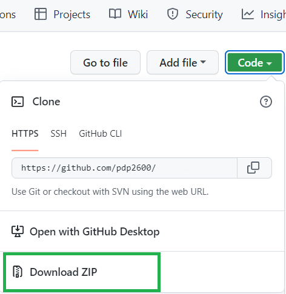

<!-- PROJECT SHIELDS -->
<!--
*** I'm using markdown "reference style" links for readability.
*** Reference links are enclosed in brackets [ ] instead of parentheses ( ).
*** See the bottom of this document for the declaration of the reference variables
*** for contributors-url, forks-url, etc. This is an optional, concise syntax you may use.
*** https://www.markdownguide.org/basic-syntax/#reference-style-links
-->
<!--
[![Contributors][contributors-shield]][contributors-url]
[![Forks][forks-shield]][forks-url]
[![Stargazers][stars-shield]][stars-url]
[![Issues][issues-shield]][issues-url]
-->
&nbsp;&nbsp;&nbsp;&nbsp;&nbsp;&nbsp;[![GNU AGPLv3 License][license-shield]][license-url]
[![LinkedIn][linkedin-shield]][linkedin-url]
[![Twitter][twitter-shield]][twitter-url]
[![Twitter Follow][twitter-follow-shield]][twitter-follow-url]
<!-- 
[![Current Version][version-shield]][git-url]
-->

<!-- PROJECT LOGO -->
 

  

  <h3 align="center">Fighting Game Watcher «» Guilty Gear Strive</h3>

  

    A computer vision Python tool to extract data from gameplay videos of the competitive fighting game <a href="https://www.guiltygear.com/ggst/en/about/" target="_blank">Guilty Gear Strive</a>, and aggregate the data into rounds/games w/ outcomes and character usage data.
     
    <a href="https://www.youtube.com/watch?v=lLLPob7dKVQ" target="_blank"><strong>View Short Demo (12mins) »</strong></a>
     
    <a href="https://www.youtube.com/watch?v=s-lIaSLesn0" target="_blank">View Longer Demo (~90mins)</a>
	 
  

<!-- TABLE OF CONTENTS -->

  
Table of Contents

  <ol>
    <li>
      <a href="#about-the-project">About The Project</a>
      <ul>
		<li><a href="#match-data-gathered">Match Data Gathered</a></li>
		<li><a href="#output-files-generated">Output Files Generated</a></li>
		<li><a href="#built-with">Built With</a></li>
		<li><a href="#files">Files</a></li>
      </ul>
    </li>
    <li>
      <a href="#getting-started">Getting Started</a>
      <ul>
        <li><a href="#prerequisites">Prerequisites</a></li>
        <li><a href="#installation">Installation</a></li>
      </ul>
    </li>
    <li>
	  <a href="#usage">Usage</a>
	  <ul>
	    <li><a href="#known-limitations">Known Limitations</a></li>
	  </ul>
	</li>
    <li>
	  <a href="#roadmap">Roadmap</a>
	  <ul>
	    <li><a href="#short-term">Short Term</a></li>
		<li><a href="#mid-term">Mid Term</a></li>
		<li><a href="#long-term">Long Term</a></li>
	  </ul>
	</li>
    <li><a href="#license">License</a></li>
    <li><a href="#contact">Contact</a></li>
    <li><a href="#acknowledgments">Acknowledgments</a></li>
  </ol>

<!-- ABOUT THE PROJECT -->
## About The Project

Currently, in this initial version, I believe what is present "in the box" will be most useful for anyone interested in compiling Guilty Gear Strive related stats for analysis, and content creators/video editors who have raw video of GGST matches where knowing the timestamps where the games start could save time/be useful. 

With this first version, I see it as the foundational tech for automated gathering of data from video of Guilty Gear Strive matches, enabling the compilation of interesting stats and using the data for other potentially useful applications/services. I have wanted to create a tool like this since about a decade ago, watching every (vanilla) Marvel vs Capcom 3 tournament which was streamed. Thinking to myself, the different cool applications of having a large amount of data, which doesn't require the manual effort of a person watching and documenting matches. The continuing goal is to add more data points the tool can gather, create more accessible applications using the data/tech, create other useful output form factors of the data, and eventually evolving the lessons learned into a framework to assist in creating similiar computer vision tools for other fighting games.

### Match Data Gathered
- **Game level data points**:
    - **Outcome of each game** - Either won by Player 1 or Player 2, or an ultra rare Draw outcome.
	- **Start & End time of Game** - In seconds, provides when each game begins and ends in the video processed.
	- **Total Rounds** - Total rounds in each game.
	- **Characters Played** - Characters played by Player 1 and Player 2 in each game.
	- **Round Scores** - Rounds won by each player in each game.
- **Round level data points**:
    - **Outcome of each round** - Either won by Player 1 or Player 2, or an ultra rare Draw outcome. Round winners are most commonly determined by health values, but there is template matching for the "1P/2P Win" images which show up when players don't press any buttons quickly after round end (in tournament streams they are not too common). There is also a confidence value indicating the certainty of the predicted winner.
	- **Start & End time of Round** - In seconds, provides when each rounde begins and ends in the video processed.
	- **Round Number** - What the round's number is in the given game, if there was a match on the template images used to detect the round indicators at the start of each round.
	- **Characters Played** - Characters played by Player 1 and Player 2 in each round.
	- **Special Round End States** - There are a few atypical states a round can end in "Perfect", "Double KO", and "Time Out", those are capture in the data.

(<a href="#top">back to top</a>)

	
### Output Files Generated
There are sample output files generated from processing the 12 minute demo video in <a href="https://github.com/pdp2600/fighting-game-watcher/tree/master/output/FPS2-2022-6-6_16-55-57_FGW-12min-Demo_May-31-202" target="_blank">2 Frames per Second</a> and <a href="https://github.com/pdp2600/fighting-game-watcher/tree/master/output/FPS4-2022-6-6_16-16-36_FGW-12min-Demo_May-31-202" target="_blank">4 Frames per Second</a> if you'd like practical examples of the  descriptions below.

- **Game level Playlist** - An XML Shareable Playlist for the video, with custom VLC bookmarks to jump/seek to the start of every aggregated game and anomolous round (if any exist). Descriptions of bookmarks will use game_id/anomaly_id & characters used (if they've been detected) by default.
- **Round level Playlist** - An XML Shareable Playlist for the video, with custom VLC bookmarks to jump/seek to the start of every game round and anomolous round (if any exist). Descriptions of bookmarks will use game_id/anomaly_id, round number, & characters used (if they've been detected) by default.
- **Game level YouTube Chapters** - A text file with the start of every game as a Youtube chapter. This text is formatted such that it can be pasted into the description of the YouTube version of the video, to have chapters automatically be created. The chapter label will depend on a few of each game's data values. When the 1st game starts 11 seconds or later into the video, 1st chapter will be at 0:00 & label "Lets Rock" (YouTube chapter syntax requires 1st chapter be at 0:00 & there cannot be chapters which are 10 seconds or less apart).
- **Round level YouTube Chapters** - A text file with the start of every game's rounds as a Youtube chapter. This text is formatted such that it can be pasted into the description of the YouTube version of the video, to have chapters automatically be created. The chapter label will depend on a few of each round's data values. When the 1st round starts 11 seconds or later into the video, 1st chapter will be at 0:00 & label "Lets Rock" (YouTube chapter syntax requires 1st chapter be at 0:00 & there cannot be chapters which are 10 seconds or less apart).
- **Visual Detection Raw Data** - CSV file which contains the template match scores & health bar values detected. When a template match score is less than the minimum for the specific template or category of template, score will be 0. Each row is a processed frame from the video, where the number of rows are equal to Length of video in seconds * frames per second processed. Example of columns (they can change depending on the template images defined in config variables when process is started):

  
<i>Visual Detection Raw Data Columns</i>

  <ol>
    <ul>
		<li><b>Time_in_Secs</b> - What second in the video the frame is from. Basically the <i>Frame_Number_secs</i> value rounded down to an integer.</li>
		<li><b>Frame_Number_secs</b> - Specific fractional second the frame was taken from the video. The value each frame increments by is 1 / processing frames per second (FPS 4 = 0.25, FPS 2 = 0.5, etc).</li>
		<li><b>Starter_Duel</b> - Template image match score for the "Duel" part of the image which appears at each rounds start to state what the round "number" is.</li>
		<li><b>Starter_Number_1</b> - Template image match score which indicates round 1 is about to start. This template match had a tendency for false positives, so there is extra logic to try to prevent them from hindering the accuracy of the aggregation steps.</li>
		<li><b>Starter_Number_2</b> - Template image match score which indicates round 2 is about to start.</li>
		<li><b>Starter_Number_3</b> - Template image match score which indicates round 3 is about to start.</li>
		<li><b>Starter_Number_Final</b> - Template image match score which indicates the Final round is about to start. Final rounds will only happen when there's a third round which ends in a draw or the first 2 rounds of the game are both draws. There are no more rounds in a game after a Final round, regardless of the outcome.</li>
		<li><b>Starter_Lets_Rock</b> - Template image match score for the image which appears after the "Duel" round number indicator image at round start. It's used as a back up for detecting when a round starts if "Duel" cannot be detected (though without the round number data).</li>
		<li><b>Ender_Slash</b> - Template image match score for the image which most rounds end with.</li>
		<li><b>Ender_Perfect</b> - Template image match score for the image indicating a round ended in a Perfect.</li>
		<li><b>Ender_Double_KO</b> - Template image match score for the image indicating a round ended in a Double KO.</li>
		<li><b>Ender_Times_Up</b> - Template image match score for the image indicating a round ended in a Time Out (time ran out without one player defeating another).</li>
		<li><b>Ender_Draw</b> - Template image match score for a secondary round ender image, which follows a Double KO ender, or a Time Out if both players' health is equal. Indicates the round was a Draw.</li>
		<li><b>Game_UI_Timer_Outline</b> - Template image match score of the game timer outline image. This match is used to determine if the UI is on screen, to help filter out health detection false positives caused by visual effects and cinematics (some overdrives & character win pose screens).</li>
		<li><i><b>{</b>Character_Name<b>}</b></i><b>_1P_Portrait</b> - For every character template image submitted in the config, there will be a column like this for each one with the character's name. It's the template match score for this character's Player 1 side portrait, used to detect what character in the round is being played by Player 1.</li>
		<li><i><b>{</b>Character_Name<b>}</b></i><b>_2P_Portrait</b> - For every character template image submitted in the config, there will be a column like this for each one with the character's name. It's the template match score for this character's Player 2 side portrait, used to detect what character in the round is being played by Player 2.</li>
		<li><b>1P_High_Health</b> - Length of the area detected as Player 1's "high" health value. The function detects horizontal lines which are in the range of colours of the health bar when health is high. Per frame, high and low health for each player should be mutually exclusive since it can only be in the colour range of one or the other.</li>
		<li><b>1P_Low_Health</b> - Length of the area detected as Player 1's "low" health value. The function detects horizontal lines which are in the range of colours of the health bar when health is low (a sort of orange colour). Per frame, high and low health for each player should be mutually exclusive since it can only be in the colour range of one or the other.</li>
		<li><b>2P_High_Health</b> - Length of the area detected as Player 2's "high" health value. The function detects horizontal lines which are in the range of colours of the health bar when health is high. Per frame, high and low health for each player should be mutually exclusive since it can only be in the colour range of one or the other.</li>
		<li><b>2P_Low_Health</b> - Length of the area detected as Player 2's "low" health value. The function detects horizontal lines which are in the range of colours of the health bar when health is low (a sort of orange colour). Per frame, high and low health for each player should be mutually exclusive since it can only be in the colour range of one or the other.</li>
		<li><b>Ender_1P_Win</b> - Template image match score for the image indicating Player 1 won a round or the entire game. While it's the best indicator of which player won the round/game, in practice it's not common to see, as players can skip to the next round/game by pressing a button, instead of watching the post round win poses which preceed the template image.</li>
		<li><b>Ender_2P_Win</b> - Template image match score for the image indicating Player 2 won a round or the entire game. While it's the best indicator of which player won the round/game, in practice it's not common to see, as players can skip to the next round/game by pressing a button, instead of watching the post round win poses which preceed the template image.</li>
	</ul>
  </ol>

- **Round Data** - CSV file which is the result of aggregating the raw data into Rounds. Accurate aggregation of rounds requires being able to detect a round's starter images and ender. Contains the following columns:

  
<i>Round Data Columns</i>

  <ol>
    <ul>
		<li><b>start_secs</b> - When the round starts in the video by seconds.</li>
		<li><b>start_index</b> - Where the round starts in the video based on frames/index.</li>
		<li><b>end_secs</b> - When the round ends in the video by seconds.</li>
		<li><b>end_index</b> - Where the round ends in the video based on frames/index.</li>
		<li><b>round</b> - Round number if it could be detected at round start.</li>
		<li><b>winner</b> - Outcome of the round either: Player 1, Player 2, Draw, or Unknown.</li>
		<li><b>winner_via_health</b> - Winner based on checking health values either: Player 1, Player 2, or Unknown.</li>
		<li><b>winner_via_tmplate_match</b> - Winner based on detecting 1P/2P Win template images either: Player 1, Player 2, or Unknown.</li>
		<li><b>winner_confidence</b> - 5 confidence levels, representing the accuracy of the predicted winner based on conditions in play. A level of "Very Low" indicates a possibility that the predicted winner by health might be wrong. Values Confidence can be: Very High, High, Medium, Low, Very Low.</li>
		<li><b>character_1P</b> - Character Player 1 used in the round. Value of Unknown if no single character could be detected.</li>
		<li><b>character_2P</b> - Character Player 2 used in the round. Value of Unknown if no single character could be detected.</li>
		<li><b>perfect</b> - Boolean value whether round ended in a Perfect round for a player.</li>
		<li><b>double_ko</b> - Boolean value whther round ended in a Double KO. When this is True, "draw" value is set to True.</li>
		<li><b>time_out</b> - Boolean value whether round ended in a Time Out. Time Out rounds can also end in Draws (which for Time Outs is based on Draw template image detected after Time Out is detected).</li>
		<li><b>draw</b> - Boolean value whether the round outcome was a Draw. Only 2 ways a round can end in a Draw, a Double KO end, or a Time Out which was also a Draw.</li>
		<li><b>inconclusive_data</b> - Boolean value whether there were any inconsistencies with the round, like not detecting a valid starter or ender.</li>
		<li><b>inconclusive_note</b> - Text about what specifically was flagged as inconclusive.</li>
		<li><b>game_id</b> - Generated ids for the game the round has been aggregated to. They take on the format of "Game_01", "Game_02", .., "Game_15", etc.</li>
   	</ul>
  </ol>

- **Game Data** - CSV file which is the result of aggregating the round data into Games. Game aggregation accuracy, is mainly dependant on Round number values, currently the aggregation method can withstand Unknown round numbers, as long as there isn't more than 1 consequective Unknown round. Contains the following columns:

  
<i>Game Data Columns</i>

  <ol>
    <ul>
		<li><b>game_id</b> - Generated ids for the game, same id connected to the "game_id" in the ROund data. They take on the format of "Game_01", "Game_02", .., "Game_15", etc.</li>
		<li><b>start_secs</b> - When game starts in the video by seconds. Based on 1st round's start.</li>
		<li><b>end_secs</b> - When game ends in the video by seconds. Based on last round's end.</li>
		<li><b>start_index</b> - Where the game starts in the video based on frames/index. Based on 1st round's start.</li>
		<li><b>end_index</b> - Where the game ends in the video based on frames/index. Based on 1st round's start.</li>
		<li><b>total_rounds</b> - The number of rounds which make the game.</li>
		<li><b>character_1P</b> - Character Player 1 used in the game. Value of Unknown if the character_1P value is different amongst the game's rounds.</li>
		<li><b>character_2P</b> - Character Player 2 used in the game. Value of Unknown if the character_2P value is different amongst the game's rounds.</li>
		<li><b>winner</b> - Based on the winners of the rounds aggregated into the game. With the nature of best 2 out of 3, only the last round needs to have an accurate outcome, making game winner accuracy fairly resilient even w/ some erroneous round winners. Value can be either: Player 1, Player 2, Unknown, or Draw (which is extremely rare for a game outcome, even the game itself doesn't handle a draw game, it plays the Player 1 win pose cutscene).</li>
		<li><b>player_1_rounds_won</b> - Number of rounds won by Player 1. These values are usually calculated based on total_rounds & the winner of the last round of the game. There is a known issue when 1st round is a Draw & a winner in the 2nd/last round score will be 2-0 instead of 2-1.</li>
		<li><b>player_2_rounds_won</b> - Number of rounds won by Player 2. These values are usually calculated based on total_rounds & the winner of the last round of the game. There is a known issue when 1st round is a Draw & a winner in the 2nd/last round score will be 2-0 instead of 2-1.</li>
		<li><b>inconclusive_data</b> - Boolean value whether there were any inconsistencies with the game. If there are no issues on the game level, inconclusive round notes will be propagated up if any exist.</li>
		<li><b>inconclusive_note</b> - Text about what specifically was flagged as inconclusive.</li>
   	</ul>
  </ol>

- **Anomalous Round Data** - CSV file which contains the rounds which were not aggregated into games. Contains the following columns:

  
<i>Anomalous Round Data Columns</i>

  <ol>
    <ul>
		<li><b>start_secs</b> - When the round starts in the video by seconds.</li>
		<li><b>start_index</b> - Where the round starts in the video based on frames/index.</li>
		<li><b>end_secs</b> - When the round ends in the video by seconds.</li>
		<li><b>end_index</b> - Where the round ends in the video based on frames/index.</li>
		<li><b>round</b> - Round number if it could be detected at round start.</li>
		<li><b>winner</b> - Outcome of the round either: Player 1, Player 2, Draw, or Unknown.</li>
		<li><b>winner_via_health</b> - Winner based on checking health values either: Player 1, Player 2, or Unknown.</li>
		<li><b>winner_via_tmplate_match</b> - Winner based on detecting 1P/2P Win template images either: Player 1, Player 2, or Unknown.</li>
		<li><b>winner_confidence</b> - 5 confidence levels, representing the accuracy of the predicted winner based on conditions in play. A level of "Very Low" indicates a possibility that the predicted winner by health might be wrong. Values Confidence can be: Very High, High, Medium, Low, Very Low.</li>
		<li><b>character_1P</b> - Character Player 1 used in the round. Value of Unknown if no single character could be detected.</li>
		<li><b>character_2P</b> - Character Player 2 used in the round. Value of Unknown if no single character could be detected.</li>
		<li><b>perfect</b> - Boolean value whether round ended in a Perfect round for a player.</li>
		<li><b>double_ko</b> - Boolean value whther round ended in a Double KO. When this is True, "draw" value is set to True.</li>
		<li><b>time_out</b> - Boolean value whether round ended in a Time Out. Time Out rounds can also end in Draws (which for Time Outs is based on Draw template image detected after Time Out is detected).</li>
		<li><b>draw</b> - Boolean value whether the round outcome was a Draw. Only 2 ways a round can end in a Draw, a Double KO end, or a Time Out which was also a Draw.</li>
		<li><b>inconclusive_data</b> - Boolean value whether there were any inconsistencies with the round, like not detecting a valid starter or ender.</li>
		<li><b>inconclusive_note</b> - Text about what specifically was flagged as inconclusive.</li>
		<li><b>anomaly_id</b> - Generated ids for the anomalous round which could be aggregated into a game. They take on the format of "Anomaly_01", "Anomaly_02", .., "Anomaly_15", etc.</li>
   	</ul>
  </ol>

- **JSON Round & Game Data** - JSON formatted file, which is the aggregated game data, with its rounds' data nested under each game. Below is the JSON's structure, check Round & Game data column definitions above for more details about the fields:

  
<i>JSON Keys & Structure</i>

  <pre>
{
 "original_vid_filename": str -Filename of video processed , 
 "youtube_video_link": str -User defined URL meant to be the original source, 
 "games": [
			{
			 "id": str, 
			 "start_secs": int, 
			 "end_secs": int, 
			 "start_index": int, 
			 "end_index": int, 
			 "total_rounds": int, 
			 "character_1P": str, 
			 "character_2P": str, 
			 "winner": str, 
			 "player_1_rounds_won": int, 
			 "player_2_rounds_won": int, 
			 "inconclusive_data": bool, 
			 "inconclusive_note": str, 
			 "rounds": [
						{
						 "round": str, 
						 "start_secs": int, 
						 "end_secs": int, 
						 "start_index": int, 
						 "end_index": int, 
						 "character_1P": str, 
						 "character_2P": str, 
						 "winner": str, 
						 "winner_confidence": str, 
						 "winner_via_health": str, 
						 "winner_via_tmplate_match": str, 
						 "perfect": bool, 
						 "double_ko": bool, 
						 "time_out": bool, 
						 "draw": bool, 
						 "inconclusive_data": bool, 
						 "inconclusive_note": str
						}, ..
					   ]
	        }, ..	
		 ]
}
  </pre>

(<a href="#top">back to top</a>)

### Built With

* <a href="https://opencv.org/" target="_blank">OpenCV</a>
* <a href="https://pandas.pydata.org/" target="_blank">Pandas</a>
* <a href="https://numpy.org/" target="_blank">NumPy</a>

(<a href="#top">back to top</a>)

### Files
* `README.md` - This file you're reading right now.
* `LICENSE.txt` - License which the tool can be used under.
* `FGWatcher_all_data_extract_and_agg_example_script.py` - Example script for processing a video to attempt to get as much data as the tool is capable of getting. See <a href="#usage">Usage section</a> for more details.
* `FGWatcher_only_game_round_timecodes_example_script.py` - Example script for processing a video to get only Round Start and End data (no character data, no outcome predictions). See <a href="#usage">Usage section</a> for more details.
* `FGW-GGST-environment.yml` - File with all the tools dependancies, formatted to be used for automatically creating an Anaconda environment to those specs.
* `conf\config_values.py` - Config file solely consisting of Python variables which store values/template image locations that are required for extraction and aggregation. Note that the dictionary <i>agg_config_4fps</i> has configuration values which are based on frames per second to process a video at, are based on 4 frames per second, if a video is to be processed at another FPS, these values will be scaled for that FPS.
* `demo_video\FGW-12min-Demo_May-31-2022.mp4` - Optional 12 minute demo video if you don't have a Guilty Gear Strive video file available. This is also the original video the <a href="https://www.youtube.com/watch?v=lLLPob7dKVQ" target="_blank">Short Visual Demo</a> was based on and the output files from processing the video at 2 & 4 FPS will be in the `\output\` folder as well to have baselines to compare to. The video is 653MB (many times larger than the other files combined), only download if you don't have any GGST video files of your own.
* `modules\ggst\extraction.py` - FG Watcher local module with extraction related functions defined.
* `modules\ggst\aggregation.py` - FG Watcher local module with aggregation related functions defined.
* `modules\ggst\output.py` - FG Watcher local module with output file generation related functions defined.
* `modules\ggst\controller.py` - FG Watcher local module defining functions related to integrating the extraction, aggregation, and output functions. This module is the "mastermind" or "brains" of the tool.
* `output\` - Folder where all the data and output files are written to for every video processed. Folders created by the tool will be based on the current timestamp to ensure folder name is always unique. Ships with the output and data files from the demo video being processed at 2 and 4 frames per second as an example/baseline.
* `template_imgs\` - Folder which stores the template images used for template matching, as well as some images which are not currently used by the tool. The file paths for the images used are defined in the config file.
* `readme_imgs\` - Folder which stores any local visual assets used by <i>README.md</i>.

(<a href="#top">back to top</a>)

<!-- GETTING STARTED -->
## Getting Started

The install instructions assume there are 2 types of users: 
* People more experienced with programming (in Python), who already have their own preferred dependancy manager/environment/IDE/etc and just need a few details to get going. These details will be at the top of each respective section.
* People who don't have any/much of a background in Python/Programming. I'll try to provide a bit more details and guidance with steps to get a Miniconda environment running. Miniconda is a simple, stripped down dependency manager for Data Science. With a Windows 11 install, Miniconda took up about 3GB for its base files, and 1.85GB for the FGW environment/dependency installation, for close to 5GBs. In each section, the more detailed steps will follow a more brief overview.

(<a href="#top">back to top</a>)

### Prerequisites
#### Overview
The tool assumes `Python 3.9.7` or later. The following three packages/modules are required as well (all the others used should be a part of the default Python library):
* opencv (cv2)
* pandas
* numpy

If you want to access and download the video demo file (~650MB), Git and <a href="https://git-lfs.github.com/" target="_blank">Git LFS</a> will need to be installed on the system/environment, and Git LFS enabled (`git lfs install`). Cloning the repository should download the video file once Git LFS is setup.

(<a href="#top">back to top</a>)

#### MiniConda Environment Creation
If going the route of following the specific MiniConda instructions, the only pre-requisite is installing MiniConda. Links to MiniConda installers for different platforms can be found <a href="https://docs.conda.io/en/latest/miniconda.html#latest-miniconda-installer-links" target="_blank">here</a> on the official Anaconda site. Run the installer completely before proceeding to the steps below.

### Installation
#### Overview
If you have your Python environments all setup (required packages installed & Git LFS enabled for the environment):

`git clone https://github.com/pdp2600/fighting-game-watcher.git`

#### Specific Steps for MiniConda
<ol>
  <li>
    Download the project source files from the Fighting Game Watcher <a href="https://github.com/pdp2600/fighting-game-watcher" target="_blank">github location</a>:
	<ol>
	  <li>Click on the green "Code" button around the top-right, left of the "About" section.</li>
	  <li>In the dropdown, click on "Download ZIP" option to start downloading a zip of all the files: </li>
	</ol>
  </li>
  <li>
    Once download is complete, on your computer:
	<ol>
		<li>Unzip the all the contents of the downloaded zip file into a directory.</li>
		<li>Assuming Miniconda has been installed, open an "Anaconda Prompt" (can usually find it if you search for "cmd").</li>
		<li>In the Anconda Prompt commandline/terminal window, change the current directory to be the one which the source files were unzipped into, i.e. <pre>cd C:\Full\File\path\to\FGW_files</pre></li>
		<li>To create a new Anaconda Python environment with everything FGW requires, in the Anaconda Prompt commandline, run: <pre>conda env create -f FGW-GGST-environment.yml</pre> This creates a new Anaconda environment based on a yml file for this purpose included with the source code.</li>
	</ol>
  </li>
  <li>
    After Anaconda environment has been created, to run the FGW Python files:
	<ol>
		<li>In an Anaconda prompt window, change current directory to where the FGW project files are.</li>
		<li>Run the command <pre>conda activate fighting-game-watcher-GGST</pre> to activate the Python environment (name of environment created assumed to be what the default name is in FGW-GGST-environment.yml).</li>
		<li>You'll be able to run any of the Python files which are meant to run as main scripts with the command <pre>python FGW-file-name-1.py</pre></li> See <a href="#usage">Usage section</a> for more specific details.</li>
	</ol>
  </li>
  <li>
    (Optional)If you want the included demo video file (i.e. you don't have any of your own):
	<ol>
		<li>Accessing Github repositories in the methods instructed below requires a Github account, if needed sign up for one <a href="https://github.com/join" target="_blank">here</a>.</li>
		<li>With an Anaconda prompt window open, while in the current directory you'd like the <code>fighting-game-watcher</code> folder to be created in, and the project's environment activated, setup the environment's local git with your Github username and email associated with the account: <pre>git config --global user.email "my_email523@emaildomain.ca"</pre><pre>git config --global user.name "GitHubUserName"</pre> You'll also be prompted for the password the first time in a session a command is used which requires authentication.</li>
		<li>To be able to access larger files in a Git repository, Git LFS needs to be enabled. Miniconda automated environment creation will have already installed the library, to enable it run: <pre>git lfs install</pre></li>
		<li>To copy all the files (including the large video demo file) from Github and create a new git repository locally run: <pre>git clone https://github.com/pdp2600/fighting-game-watcher.git</pre></li>
	</ol>
  </li>
</ol>

(<a href="#top">back to top</a>)

<!-- USAGE EXAMPLES -->
## Usage
Currently the tool works only for video files, whose encoding is compatiable with OpenCv, and has a resoloution of 1920 x 1080. For more details, as well what is planned to add more versatile support for video files check out the <a href="#known-limitations">Limitations</a> section. 

In the source files there are 2 scripts which each the 2 practical applications of the tool: 
- `FGWatcher_all_data_extract_and_agg_example_script.py` which will batch process video files attempting to get as much match data the tool is currently capable of gathering, utilizing the  `layered_extract_and_aggregate_video` function. Benchmark ranges for processing videos with this function (run on a notebook with an Intel Core i7 8750H @ 2.2GHz & 16GB RAM, processing didn't leverage its graphics card):
  * For 2 FPS processing, processing times for ever second of video was a range of 1.8 to 2.4 seconds (average was close to 2).
  * For 4 FPS processing, processing times for ever second of video was a range of 3.6 to 4.5 seconds (average was close to 3.9)
- `FGWatcher_only_game_round_timecodes_example_script.py` which will batch process video files attempting to just get round start and end timecodes, utilizing the  `extract_match_video_timecodes_only` function. This process is really only useful for the VLC playlist it generates with the round or game start times as bookmarks (also generates Youtube Chapters, but without descriptive labels since character data isn't available). Benchmark ranges for processing videos with this function (run on a notebook with an Intel Core i7 8750H @ 2.2GHz & 16GB RAM, processing didn't leverage its graphics card):
  * For 2 FPS processing, processing times for ever second of video was a range of 0.8 to 0.9 seconds (average was close to 2).
  * For 4 FPS processing, processing times for ever second of video was a range of 1.6 to 1.8 seconds (average was close to 1.8)

(<a href="#top">back to top</a>)

  
 
### Overview
For both `FGWatcher_all_data_extract_and_agg_example_script.py` and `FGWatcher_only_game_round_timecodes_example_script.py` here are a few details which apply to both:
  - They're written to be run from the commandline i.e. `python FGWatcher_only_game_round_timecodes_example_script.py` 
    * If running code via an IDE's IPython console (or equivalent), working directory will need to be set to the location of the FGW files:
	  - At the top of the script comment the line `wd_path = os.path.dirname(__file__)`
	  - A few lines below, uncomment the line: 
	  `#wd_path = "D:\\Libraries\\Documents\\Data_Science\\Projects\\FGC_Stream_Reader"`  
	  and set it to the full path of the FGW file folder.
  - At the top of the `main` function, there are variable definitions for the FPS the video will be processed at. The values are set to 2 and 4, with the 2 value defaulting as being uncommented:
    * `#fps_val = 4`
    * `fps_val = 2`
	- For most videos, 2 FPS should be enough for most videos. In my comparison of Game level result accuracy, the results were exactly the same with a couple of videos being slightly inaccurate by 1-3%. 4 FPS does provide more granularity of data to draw from & is most useful in cases where round starter/ender images in the video, are not shown full screen for as long as the game displays them. Even though it takes double the time to process, it's worht using 4FPS for videos with a lot of edits/cuts away from the Guilty Gear Strive game footage.
  - To add your own videos for processing:
    * In the `main` function, find the line of code: `#videos.append("D:\\full\\path\\to\\video_file.mp4")`
	  - Copy the line and paste it to a new line below.
	  - Uncomment the line and replace the file path, with the full path to a video you want to process.
	  - Repeat for every video you'd like to add to be processed.
  - After processing is completed for each video, the output files will be written in a folder created in the `output\` folder which was a part of the source files. Folder and file names will use the first 22 characters of the video filename, and the timestamp at the time to create a unique folder name.

(<a href="#top">back to top</a>)

### MiniConda Specific Usage Steps
<ol>
  <li>Open an "Anaconda Prompt" (can usually find it if you search for "cmd").</li>
  <li>In the Anconda Prompt commandline/terminal window, change the current directory to be the one the FGW source files are in, i.e. <pre>cd C:\Full\File\path\to\FGW_files</pre></li>
  <li>Run the command <pre>conda activate fighting-game-watcher-GGST</pre> to activate the Python environment (assuming name of environment was named with the default environment name).</li>
  <li>To run either <code>FGWatcher_all_data_extract_and_agg_example_script.py</code> or <code>FGWatcher_only_game_round_timecodes_example_script.py</code>, run the command: <pre>python FGWatcher_only_game_round_timecodes_example_script.py</pre></li>
</ol>

(<a href="#top">back to top</a>)

### Known Limitations
In this version video files used for processing need to be:
* Compatiable with OpenCv (all common encodings should be)
* 1920 x 1080 resoloution

While the current version of the code was built with some "hooks" which would be required to automatically scale the template images down to do matching for a resoloution lower than 1920 x 1080, and there wouldn't be too many steps to implementing that feature (as well as scaling video frames larger than that resoloution down to 1920 x 1080), the testing time to get a sense of the accuracy of a feature like that would not be trivial. Some of the features I will attempt to implement for the tool in the near-ish future:
- Videos with resoloution higher than 1920 x 1080, automatically scale down video frames.
- Videos with resoloution lower than 1920 x 1080, automatically scale down template images.
- Support GGST gameplay footage not full screen as a part of an overlay, with user definiing the bounding box/location of the footage in the video (so the tool can use that as the source).
- Update Health detection algorithm to be able to scale down values used based on width/height in pixels.

(<a href="#top">back to top</a>)

#### Video Source Incompatiable Broadcast Styles
At a foundational level, the tool relies on being able to detect round start (i.e. "Duel 1", "Lets Rock") and end (i.e. "Slash", "Perfect", etc) indicators, which some stream broadcasts will regularly not show those elements in the full screen, or at all. An example of these conditions present is this archive of the Frosty Faustings XIV 2022 <a href="https://www.youtube.com/watch?v=NgTvgkzuYSs">Top 96</a> strem broadcast. The result of 4FPS processing (2FPS was slightly worse with more missed games) the accuracy of game results was 70%, where all the other videos tested, both 2 and 4 FPS processing, had a game result accuracy between 95%-100% (average accuracy of 98%).
- Missing Starters, specifically identifying the round number, can cause issues with aggregating rounds into games. There's currently a tolerance of one Unknown round number in a row, but with 2 Unknown rounds in a row, at least one of them will be considered anamolous and not aggregated even if it's a round that belongs to a legit game. In future development, I'm going to experiment with expanding game aggregation for edge cases which can be reliably predicted, but the issue will still remain when there are too many consequective Unknown round numbers.
- Missing Enders in a round make it impossible to predict the Winner of the round via Health or 1P/2P Win template match, since both those require knowing the approximate end of a round. In future development, I plan on looking into creating a function to look for ender/winner indicators differently (i.e. looking for win pose screens, ender templates scaled down smaller in the video, ender based on game UI disappearing, etc), to be run in cases where the first detection pass through aggregation reveals them missing.
-If there are consecutive missing Starters and Enders, that's the worst possible condition, as 2 or more rounds will likely aggregated togther, and even one round like that can potentially cause incorrect data and aggregation for 2 or more games. Results like that likely require much more manually checking.
- Too many missing starters and ender will also increase processing time, since the approach to optimize processing relies on the tool able to find which frames in the video are GGST gameplay rounds. In future development, I'm hoping to add a function to do targeted scaled down template matching of Starters and/or Enders, when there's a missing Starter/Ender. In an attempt to address the case where a broadcast has the beginning and end of rounds not shown fullscreen but as a smaller size, in an overlay with other visual elements (i.e. player camera feeds).

Game result/data accuracy, usually is very good, but on the Round level things can be less accurate, that should be kept in mind when utilizing the tool for data analysis. The Round winner is usually the data point most likely to be incorrect, and the winner confidence level being "Very Low" is usually an indicator that it might be incorrect. In this version, Draw outcomes will have a blank/None value for confidence, even though that outcome is considered a High Confidence outcome as it's based on specific enders. In the future Draw round outcomes will be given a "High" confidence value instead of being left blank.

(<a href="#top">back to top</a>)

<!-- ROADMAP -->
## Roadmap

### Short Term
- [ ] Add Template Images & Configuration for new Season 2 Characters
	- [X] Bridget
	- [X] Sin Kiske
	- [ ] Character 3 (Coming March 2023)
	- [ ] Character 4 (Coming May 2023)
- [ ] Enable Usage of Videos with Resoloutions Different than 1992x1080
	- [ ] Allow for Higher res videos - Scale down Frames to 1992x1080
	- [ ] Allow for Lower res videos
		- [ ] Scale down template images to Video's Resoloution
		- [ ] Scale down Health Detection values to Video's Resoloution
- [ ] Add Validation process for round outcome scores for Games with Draw rounds.

### Mid-Term
- [ ] Prototyping Extracting More Round/Game data
	- [ ] Detecting Player 1 and Player 2 having Burst available
	- [ ] Detecting the amount of meter/tension each player has at the time
- [ ] Extracting and storing images of player names from stream broadcast overlays
	
### Long Term
- [ ] Implement Tool using a framework capable of parallelization of processing (i.e. Spark)
- [ ] State based "realtime" extraction and aggregation implementation
- [ ] Add extra checks for detecting Enders when they're not detected initially
	- [ ] Checking Ender template images at smaller scaled resoloution.
	- [ ] Template matching Win Pose screens
	- [ ] Determining a more accurate round/game end, by checking for presence of game UI
- [ ] Add extra checks for detecting Starters when they're not detected initially
	- [ ] Checking Starter template images at smaller scaled resoloution.
- [ ] Add extra checks for predicting game/round winner when Unknown or Low confidence
	- [ ] Template matching Win Pose screens
- [ ] Prototype recognition of moves preformed by specific characters (i.e. Special moves, Overdrives/Supers, normals, etc) in each round.

(<a href="#top">back to top</a>)

<!-- LICENSE -->
## License

Distributed under the GNU Affero General Public License v3.0. See `LICENSE.txt` for more information.

The tool is free to use as is, if it's modified or a derrivative of it is used in a commercial or public way, that code needs to be made available publicly under the same license and proper credit attributed. I imagine most uses will just be running the tool to automate data extraction, so no other actions are required for use under the license.

If there's a need for a license allowing for closed source commercial applications, I'm open to entertaining serious inquiries about a more permissable license.

(<a href="#top">back to top</a>)

<!-- CONTACT -->
## Contact

Peter Pesic - [@PDP2600](https://twitter.com/PDP2600)
 Project Link: [https://github.com/pdp2600/fighting-game-watcher](https://github.com/pdp2600/fighting-game-watcher)

(<a href="#top">back to top</a>)

<!-- ACKNOWLEDGMENTS -->
## Acknowledgments

* [PyImageSearch](https://pyimagesearch.com/) - A lot of my Computer Vision learning has come from this site, from their OpenCv textbook to the many free tutorials on a variety of topics I've learned from, and leveraged that knowledge with Fighting Game Watcher.
* [Arc System Works](https://arcsystemworks.com/game/guilty-gear-strive/) - Developer and Publisher of Guilty Gear Strive, for making such a great fighting game I'm really passionate about! And having a visual design which finally made the implementation of this long time idea click for me, after a couple of attempts with other games.
* [Best ReadMe Template](https://github.com/othneildrew/Best-README-Template/) - Used to create this ReadMe.md.
* [Choose an Open Source License](https://choosealicense.com) - Got the license from here
* [Fighting Game Community](https://en.wikipedia.org/wiki/Fighting_game_community) - Shout outs to the FGC, hopefully there will be people who find the tool useful, and help them do dope stuff. I'm glad I could finally give back more than just being a consumer/supporter.

(<a href="#top">back to top</a>)

<!-- MARKDOWN LINKS & IMAGES -->
<!-- https://www.markdownguide.org/basic-syntax/#reference-style-links -->
[twitter-shield]: https://img.shields.io/twitter/url?logo=twitter&style=for-the-badge&label=Twitter&logoColor=EEE&colorB=555&url=https%3A%2F%2Fwww.twitter.com%2Fpdp2600
[twitter-url]: https://twitter.com/pdp2600
[twitter-follow-shield]: https://img.shields.io/twitter/follow/pdp2600?logo=twitter&logoColor=EEE&style=for-the-badge
[twitter-follow-url]: https://twitter.com/intent/user?screen_name=PDP2600
[license-shield]: https://img.shields.io/badge/LICENSE-GNU%20AGPLv3-green?style=for-the-badge
[license-url]: https://github.com/othneildrew/fighting-game-watcher/blob/master/LICENSE.txt
[linkedin-shield]: https://img.shields.io/badge/-LinkedIn-black.svg?style=for-the-badge&logo=linkedin&colorB=555
[linkedin-url]: https://www.linkedin.com/in/peter-pesic-349aa84a/
[version-shield]: https://img.shields.io/badge/version-v1.0-blue?style=for-the-badge
[git-url]: https://github.com/pdp2600/Fighting-Game-Watcher
[github-download-screenshot]: readme_imgs/Github-download-screen-1.png
